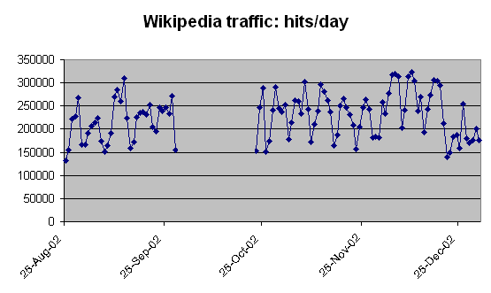

> 以下の内容はあくまで参考です。ここまでのものを作るという意味ではないので、注意ください。内容的にもでっち上げに近いです（提案内容に影響を与えないためです）。ただし、作成する内容や筋を通すことは重要です。
> 最終報告ですので、前期の内容も含め、どのような背景のもと、想定するユーザにどのような価値を提供し、実際にできたものはどうであったか、プロジェクト自体の進行はどうであったかを報告してください。
> また、例として記載しているのは、1章以降は全て「こういうことを書くと良い」というもので、同じように書くだけでは、説明が不足していますので注意して下さい（このエリアは削除してください）

# 0. タイトル
**説明:** 企画名や班番号、チームメンバーの列挙（学籍番号、名前）をしてください。企画名は、プロジェクトの目的や内容を端的に示すと良いでしょう。また、副題でアプリ名を追加することも考えられます

- **例:**
  - **企画名:** ス在庫管理システム開発プロジェクト
  - **班番号:** RWC24-group00
  - **チーム名:** あればぜひ書きましょう
  - **チームメンバー:**
    - 2312110000：近大 マグロ
    - 2312119999：近大 タイ
    - 2312111111：近大 ナマズ
    - 2312112222：近大 クエ
    - 2312113333：近大 マンゴー

# 1. プロジェクト概要
**説明:** このセクションでは、提案したプロジェクトの全体像を簡潔に記述します。ここでは、ユーザにどのような価値を届けようとしているか、それにどれだけ意義があるかが中心です。
説明箇所によっては、これまでの報告書から転載してもらっても構いません。
注意点として、当初提案しようとしていたものと大幅な変更がある場合には、担当教員と相談してください（例えば、当初はIoTで部屋の自動化をしようとしていたが、現在は購買促進のための説明デバイスにしている、など）

なお、図を用いる場合には、文中で、「図１にこれこれを示す。」などの形で引用した上で、以下のように図を貼り付けてください。
他者の作成した画像を引用する場合は、出典も併記するようにしてください。参考文献の引用の形式で良いです。図のキャプションは下付きです。

図１ Wikipedia hits per day [^5]

表の場合も、文中で、「表1にこれこれを示す。」などの形で引用した上で、以下のように記載してください。
他者の作成した表を引用する場合は、出典も明記する要因してください。図と同様に参考文献の形式で良いです。表のキャプションは上付きです。
以下は、引用ではない場合の書き方で、図の場合も引用がなければ同様の書き方をしてください。

表１　一般的なサンプルの図
| First Header  | Second Header |
| ------------- | ------------- |
| Content Cell  | Content Cell  |
| Content Cell  | Content Cell  |

**背景と課題**  
小規模事業者の手動在庫管理は、ヒューマンエラーによる在庫切れや誤発注を引き起こしやすく、効率的なオペレーションが困難だった。本プロジェクトは、その課題を解決し、在庫管理の自動化による業務改善を目指して開始された。

**目的**  
小規模ビジネス向けのリアルタイム在庫管理システムを開発し、在庫更新の自動化と効率化を実現する。

**対象ユーザと提供する価値**  
- 小規模ビジネスオーナー
  - 小規模ビジネスオーナーは、日々の業務の中で在庫管理や発注を手動で行うケースが多く、これにより時間と労力を費やしている。ヒューマンエラーや在庫切れによる売上損失、誤発注などのリスクも伴う。また、経営判断に必要なデータ分析が難しいため、経営改善に向けた意思決定が遅れることもある。
  - このシステムは、リアルタイムで在庫を管理し、自動で発注アラートを送ることで、オーナーの業務負担を軽減します。ヒューマンエラーや在庫切れのリスクが減り、効率的な運営が可能です。また、売上データの自動分析機能により、データに基づいた意思決定をサポートし、ビジネスの成長に役立ちます。
- 管理スタッフ
  - 管理スタッフはオーナーのサポートとして在庫管理や発注業務を担当するが、手動作業が多いと正確性に欠けたり、作業が煩雑化する。また、売上データや在庫情報の正確な把握が求められるため、ミスなく効率よく業務を行うためのツールが必要である。
  - 提案システムにより、管理スタッフは在庫状況をリアルタイムで確認でき、発注タイミングも自動化されるため、手動での管理作業が大幅に削減されます。売上データや在庫データが視覚化されるため、業務効率が向上し、オーナーとの情報共有がスムーズになります。また、データ分析結果を活用して適切な提案が可能になるため、ビジネス改善にも寄与します。

# 2. プロジェクトの成果物
**説明:**  このセクションでは、システムの全体像を簡潔に記述します。
プロジェクトによって開発・提供された具体的な成果物をリストアップし、それぞれの機能や利点を説明します。

## システムの概要
- システム名: 在庫管理システム
- システムの目的: スマートホーム技術の普及により、より効率的で快適な生活環境の実現が求められている[^1]。例えば〜。従って、本プロジェクトでは、次のようなシステムを提案する。〜〜（概要の説明）

## 完成したシステム
こちらで完成したシステムのUIを提示して、簡単な操作方法の説明をしてください
説明が難しいようでしたら、次の「完成した主要な機能」と一緒に説明いただいても構いません

## 完成した主要な機能
- 在庫自動更新機能: リアルタイムで在庫状況を反映し、在庫切れを防止。テストの結果・・・のように動作したので問題なし。
- 発注アラート機能: 在庫が一定以下になった際に自動的に発注を促す。テストの結果・・・のように動作したので課題は残った。
- 売上分析機能: 売上データを収集し、トレンド分析を可能にする。テストの結果・・・のように動作したので問題なし。
- ユーザ管理機能: 管理者と従業員のアカウント管理をサポート。テストの結果・・・のように動作したので問題なし。

# 3. プロジェクトの進行
**説明:**  プロジェクトが計画通りに進行したかを報告し、スケジュール、リソースの使用状況について評価してください。また、最終的な進捗と成果も記載してください。
大枠としては、プロジェクトの全体像を示し、プロジェクトが計画通りに進んだかどうか、目的通りのものが作成できたかを簡潔に記載してください。
具体的には、ガントチャートを提示し、大まかにどのような開発プロセスの予定であり、スケジュールについては「どのような原因でどのような遅れが発生したか」、リソースについては「どのような原因でどのような対応をすることになったか（例えば担当内容の変更や追加の素材、あるいはプログラムの開発など）」を述べてください。

# 4. 担当と貢献
**説明:**  プロジェクトのそれぞれのメンバーについて、前期と後期でどのような役割を担当し、内容としては何を達成したか述べてください。
また、このようなプロジェクトを体験した結果何が学べたかについて記載してください。

**近大 マグロ**  
- **前期**　プロジェクト全体の進行管理、スケジュール作成、進捗確認を行なった。具体的には、チーム全体が計画通りに進むようスケジュールを作成し、各フェーズのタスクが遅延なく進行するよう管理した。また、チームメンバーの進捗状況を定期的に確認し、必要に応じて調整やサポートを行い、プロジェクトの円滑な運営を支た。これにより、プロジェクト全体の流れが可視化され、タスクの優先順位が明確になり、各メンバーが効果的に動ける環境を整えることができた。
- **後期**　引き続き、プロジェクトの進行管理と進捗確認を行うとともに、具体的な技術的貢献としてログイン機能の実装を担当した。ユーザ認証に関するセキュリティ要件を考慮しつつ、システムにログイン機能を統合することで、ユーザが安全にアクセスできる環境を整えた。この実装により、システム全体が実際のビジネスユースに近づき、ユーザ体験が向上した。また、後期ではチーム内の進捗に関するフィードバックを活かし、タスク管理の精度やチームの連携がよりスムーズになった。
- **学べたこと**　このプロジェクトを通じて、プロジェクト管理とシステム開発の双方における貴重な経験を積むことができました。前期の進行管理を通して、プロジェクト全体を見渡しながら計画を実行し、遅延や障害に対処する能力を養いました。後期では技術的な課題を解決しながら、セキュリティを意識したシステム設計と実装の重要性を学びました。また、チームとのコミュニケーションや協働の大切さを実感し、メンバー間の役割分担や協力がプロジェクト成功の鍵であることを理解しました。

（以下例示は省略）

# 5. 問題点と課題
**説明:**  完成したプロジェクトのユーザ利用について述べ、プロジェクト完了後の課題や、システムの今後の改善提案を挙げます。さらに、次のフェーズでの計画やアップデート予定についても簡潔に記載してください。
概要では対象となる各ユーザが、どのような利点を得るか、あるいは不便があるかを、利用とシステムの機能、双方の観点で記載してください。

## 概要
まず小規模ビジネスオーナーは次のような形でシステムを利用する。（利用内容を記載。達成できた点と、問題が残る場合はその点にも触れる）
システムのテスト結果としては・・・（テスト結果に触れる）

## 一覧
- **今後の課題:** 売上データのさらなる精度向上と、大量データへの対応が必要。
  - **改善提案:** データベースのスケーラビリティを強化し、ビッグデータにも対応可能なアーキテクチャへの移行を検討。
  - **次のステップ:** 次のバージョンでは、売上予測機能を追加し、経営判断を支援する予定。

（以下、適宜羅列）

# 7. 参考リスト
**説明:**  
参考文献をこちらにリストアップしてください。開発や報告書作成において参考にしたサイトは、適宜本文中で言及しつつ記載してください。
なお、参考文献はWebサイトに限らず、書籍等も記載してください。書き方は１年次の基礎ゼミの図書館の利用説明でもあったこちらの資料を参考にしてください[^4]。他についても、Web等で調べると出てきます。  
この箇所のフォーマット上、おそらく分割線が二重になりますが、今回は気にしなくて大丈夫です。

**例**  
[^1]: 石橋 大右．“生活をより快適で便利にするスマートホームとは？”．和上ホールディングス とくとくマガジン．2024-05-24．https://wajo-holdings.jp/media/2233 ，（参照 2024-10-01)．
[^2]: Google．“Google Home"．https://home.google.com/welcome/ ，（参照 2024-10-01)．
[^3]: Amazon．“Echo & Alexa”．https://www.amazon.co.jp/b?ie=UTF8&node=5364343051 ，（参照 2024-10-01)．
[^4]: 近畿大学中央図書館レファレンス課．“引用と参考文献の書き方”．近畿大学．2022-05-01．https://www.clib.kindai.ac.jp/search/pdf/guide_quote.pdf ，（参照 2024-10-01)．
[^5]: Wikipedia. "Wikipedia hits per day late 2002 with a gap.png". https://upload.wikimedia.org/wikipedia/commons/a/a2/Wikipedia_hits_per_day_late_2002_with_a_gap.png，（参照 2024-10-03)．
